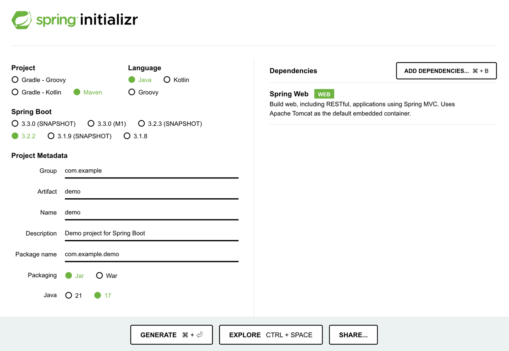
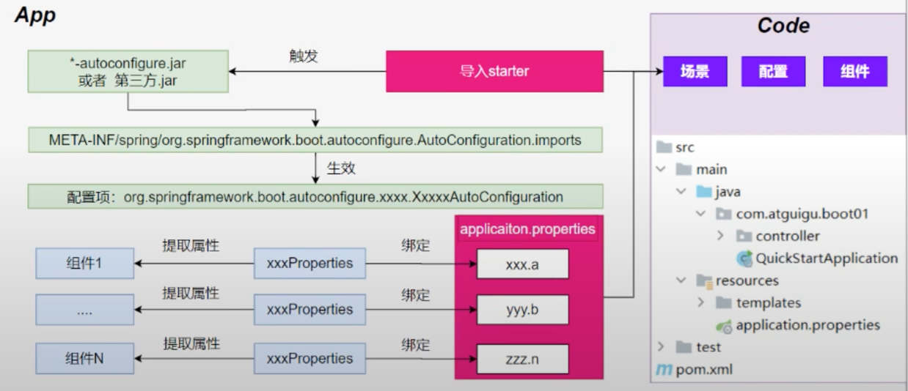

# What's springboot?
## 1. springboot 帮我们快速、简单的创建一个独立的、生产级别的 spring 应用
+ 大多数 springboot 应用只需要编写少量配置即可快速整合 spring 平台和第三方技术
+ **特性：**
  + 快速创建独立 spring 应用 
    + SSM：导包、写配置、启动运行
  + 直接嵌入 Tomcat、Jetty or Undertow（无需部署 war 包）【 serverlet 容器 】
    +  linux tomcat mysql：war 放到 tomcat 的 webapps 下
    +  jar：部署环境有 java 环境即可 java -jar
  + 提供可选的 starter，简化应用整合
    + **场景启动器（ starter ）**：web、json、邮件、oss（存储对象）、异步、定时任务、缓存...
    + 导包一堆，控制好版本
    + 为每一种场景准备了一个依赖：web-starter、mybatis-starter
  + 按需自动配置 Spring 以及第三方库 
    + 如果这些场景我要使用(生效)，这个场景的所有配置都会自动配置好
    + 约定大于配置：每个场景都有很多默认配置
    + 自定义：配置文件中修改几项就可以
  + 提供生产级特性： 如监控指标、健康检查、外部化配置等
    + 监控指标、健康检查（k8s）、外部化配置
  + 无代码生成、无 xml
## 2. 快速体验
> 场景：浏览器发送 /hello 请求，返回“hello，spring boot3
### 开发流程
1. 创建一个 maven 项目，导入场景
> 所有springboot项目都必须继承自 spring-boot-starter-parent
```xml
    <!-- pom.xml -->
    <parent>
        <groupId>org.springframework.boot</groupId>
        <artifactId>spring-boot-starter-parent</artifactId>
        <version>3.2.2</version>
    </parent>
```
> 添加 web 开发的场景启动器
```xml
    <!-- pom.xml -->    
    <dependencies>
        <dependency>
            <groupId>org.springframework.boot</groupId>
            <artifactId>spring-boot-starter-web</artifactId>
        </dependency>
    </dependencies>
```
2. 实现一个基本项目（基于官方文档说明）
> 主程序
```java
/**
 * MainApplication.java
 */
@SpringBootApplication
public class MainApplicaiton {
    public static void main(String[] args) {
        SpringApplication.run(MainApplicaiton.class, args);
    }
}
```
> 业务代码
```java
/**
 * controller/HelloController.java
 */
@RestController
public class HelloController {
  @GetMapping("/hello")
  public String Hello(){
    return "Hello, Spring boot3!";
  }
}

```
> 创建可执行 jar 包, 首先添加 Springboot 应用打包插件, 然后执行 mvn clean package
```xml
    <!-- pom.xml -->
    <build>
        <plugins>
            <plugin>
                <groupId>org.springframework.boot</groupId>
                <artifactId>spring-boot-maven-plugin</artifactId>
            </plugin>
        </plugins>
    </build>
```
> 使用命令执行打包后的文件
```dos
java -jar demo.jar
```
### 特性小结
#### 1. 简化整合
导入相关的场景，拥有相关的功能 => 场景启动器
> 默认支持的所有场景：https://docs.spring.io/spring-boot/current/reference/html/using.html#using.build-systems.starters
+ 官方提供的场景，命名为：spring-boot-starter-*
+ 第三方提供场景，命名为：*-sprint-boot-starter
场景一导入，万物皆就绪
#### 2. 简化开发
无需编写任何配置，直接开发业务
#### 3. 简化配置
`application.properties`
+ 集中式管理配置，只需要修改这个文件就行
```properties
server.port = 8888
server.address = 0.0.0.0
```
+ 配置基本都有默认值
+ 能写的所有配置都在：https://docs.spring.io/spring-boot/docs/current/reference/html/application-properties.html#appendix.application-properties
#### 4. 简化部署
打包为可执行的 jar 包
服务器上仅需有 java 环境即可
#### 5. 简化运维
修改配置(外部放一个 application.properties)、监控、健康检查
### Spring Initializer 创建向导
一键创建好整个项目（建议 IntelliJ Idea Ultimate 版本使用，社区版需登录 https://start.spring.io 页面）

## 3. 应用分析
### 1. 依赖管理机制
+ maven 依赖传递原则: A-B-C: A 就拥有 B 和 C
+ 导入场景启动器，会自动把这个场景的所有核心依赖全部导入进来
+ 每个 spring boot 项目都有一个父项目 `spring-boot-starter-parent`
+ parent 的父项目是 `spring-boot-dependencies`
+ 父项目版本仲裁中心把所有常见的 jar 的依赖版本都声明好了
+ 如需自定义版本：
  + 利用 maven 就近原则，直接在 `pom.xml` 的 `properties` 标签中声明父项目用的版本属性的 key
  + 直接在**导入依赖的时候声明版本**
+ 第三方 jar 包
  + boot 父项目没有管理的需要自行声明好
```xml
    <dependency>
        <groupId>com.alibaba</groupId>
        <artifactid>druid</artifactid>
        <version>1.2.16</version>
    </dependency>
```
### 2. 自动配置机制
#### 1. 初步理解
+ 自动配置的 Tomcat、SpringMVC 等
  + 导入场景，容器中就会自动配置好这个场景的核心组件 
  + 以前：DispatchServlet、ViewResolver、CharacterEncodingFilter...
  + 现在：自动配置好的这些组件
  + 验证：**容器中有了什么组件，就具有什么功能**
  ```java
      public static void main(String[] args) {
          var ioc = SpringApplication.run(MainApplicaiton.class, args);
  
          // 1. 获取容器中所有组件的名字
          String[] names = ioc.getBeanDefinitionNames();
          // 2. 挨个遍历: dispatcherServlet、beanNameViewResolver、characterEncodingFilter、multipartResolver
          // Spring boot 把以前配置的核心组件现在都给我们自动配置好了
          for (String name : names) {
              System.out.println(name);
          }
      }
  ```
  + 默认的包扫描规则:
    + `@SpringBootApplication` 标注的类就是主程序类
    + **Spring boot 只会扫描主程序所在的包及其下面的包, 自动的 component-scan 功能**
    + 自定义扫描路径：
      + `@SpringBootApplication(scanBasePackages="com.demo")`
      + `@ComponentScan("com.demo")` 直接指定扫描的路径
  + 配置默认值:
    + **配置文件**的所有配置项是和某个**类的对象**值进行一一绑定的 
    + 绑定了配置文件中的每一项值的类:**配置属性类**
    + ex: 
      + `ServerProperties` 绑定了所有 Tomcat 服务器有关的配置
      + `MultipartProperties` 绑定了所有文件上传相关的配置
      + 参照官方文档：https://docs.spring.io/spring-boot/docs/current/reference/html/application-properties.html#appendix.application-properties ，或者参照绑定的**配置属性类**
  + 按需加载自动配置：
    + 导入场景 `spring-boot-starter-web`
    + 场景启动器除了会导入相关功能依赖、导入一个 `spring-boot-starter`, 是所有 `starter` 的 `starter`, 是基础核心 `starter`
    + `spring-boot-starter` 导入了一个包 `spring-boot-autoconfigure`, 包里面都是各种场景的 `AutoConfiguration` **自动配置类**
    + 虽然全场景的的自动配置都在 `spring-boot-autoconfigure` 这个包，但是不是全都开启的
      + 导入哪个场景就开启哪个自动配置
+ 总结：导入场景启动器，触发 `spring-boot-autoconfigure` 这个包的自动配置生效，容器中就会具有相关场景的功能
#### 2. 完整流程

## 4. 核心技能
### 1. 常用注解
> Spring boot 摈弃 xml 配置方式, 改为**全注解驱动**
#### 1. 组件注册
**@Configuration、@SpringConfiguration  
@Bean、@Scope  
@Controller、@Service、@Reposity、@Component  
@Import  
@ComponentScan**  
> 步骤：
> 1. `@Configuration` 编写一个配置类
> 2. 在配置类中，自定义方法给容器中注册组件。配合 `@Bean`
> 3. 或使用 `@Import` 导入第三方的组件
#### 2. 条件注解
> 如果注解指定的条件成立，则触发指定行为

**`@ConditionalOnXxx`**  
**`@ConditionalOnClass`** 如果路径中存在这个类，则触发指定行为  
**`@ConditionalOnMissingClass`** 如果类路径中**不**存在这个类，则触发指定行为  
**`@ConditionalOnBean`** 如果容器中存在这个 Bean（组件），则触发指定行为
**`@ConditionalOnMissingBean`** 如果容器中**不**存在这个 Bean（组件），则触发指定行为
> 场景：
> + 如果存在 `FastSqlException` 这个类，给容器中发一个 `Cat` 组件，名 cat01
> + 否则，就给容器中放一个 `Dog` 组件，名 dog01
> + 如果容器中有`dog01`这个组件，就给容器中放一个 `User` 组件，名 zhangsan
> + 否则，就放一个 `User` 组件，名 lisi  
> ```java
>   // 如果放在类级别，如注解判断生效，则整个配置类采生效
>   @ConditionalOnMissingClass(value="com.alibaba.drui.FastSqlException") 
>   @SpringBootConfiguration
>   public class AppConfig01 {
>
>       @ConditionalOnClass(name="com.alibaba.drui.FastSqlException")
>       @Bean
>       public Cat cat01(){
>           return new Cat();
>       }
>
>       // 放在方法级别，单独对这个方法进行注解判断，如果注解生效，方法就起作用   
>       @ConditionalOnMissingClass(value="com.alibaba.drui.FastSqlException") 
>       @Bean
>       public Dog dog01(){
>           return new Dog();
>       }
>
>
>       @ConditionalOnBean(value = Dog.class)
>       @Bean
>       public User zhangsan(){
>           return new User();
>       }
>
>       @ConditionalOnMissingBean(value = Dog.class)
>       @Bean
>       public User lisi(){
>           return new User();
>       }
>   } 
> ```